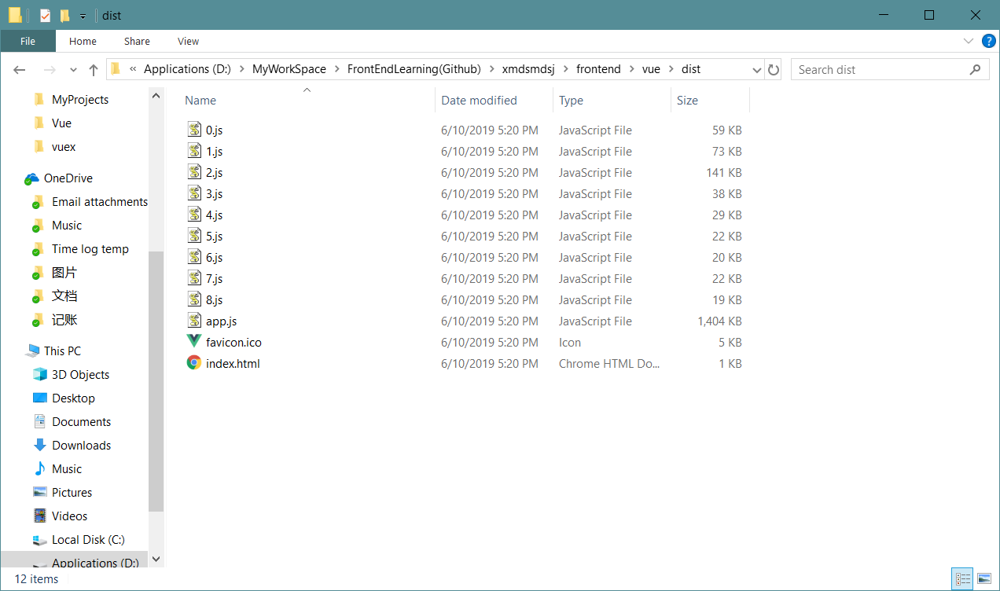

# Login From Frontend

## Connect All Web Components Together

---

### Goal

Now, we have deployed our web online in cloud. The next step to do is connecting every part together. In this task, we choose to let user login from the frontend.

Overall, the login process can be divided into the following three sub-parts:

1. Frontend receive user data and send these data by Json to backend.
2. Backend receives these data and validate it. If the form of data is legal, request data from database.
3. Database search data based on the key given by backend. Send the results back to backend.
4. Backend receives the results from database, send it back to frontend. In this part we do need to worry about cookies or sessions, so in the frontend, it needs to change page according to different users.
5. Frontend receives the data. Show a page to tell the user whether it's successful or not. And change pages accordingly if logging in succeeded.

---

### Steps

1. Finish our frontend virtual data provider.

> To accelerate our development procedure, I will try to use a "dev", "test", "prod" to control my frontend environment settings. Details could be found in Vue's [offical document](https://cli.vuejs.org/guide/mode-and-env.html#modes)
> 
> I choose to build my data provider in src/components/utils/ and call it "DataProvider.js". In this js file, it will respond different APIs based on the mode. If it is "development", it will construct fake data and feed it to the frontend. If it is "production", it will fetch the data through given API from backend.
>
> In short, it will change the way of obtaining data based on the mode using.
>
> During developing this, I found that the built frontend version, the "index.html" cannot be openned in my browser. This might be caused by the setting of building. However, it is not my major work now and I think I'd better deal with it later.
> 
> Anyway, after I deployed it to my local server, everything works fine. So the data provider is now working.

2. Finish our frontend user data showing part

> Like most modern webpages, once login is succeeded, our website can show user's name on the top right side of the nav bar on the top. And, most importantly, it will not disappear if the user changes pages within our site or refresh pages within our site.
> 
> When I working on this, I first started with building login API in frontend. When I making the APIs, I'd like to build these APIs to be easy to change between versions as what I did in the backend.
> 
> So I start my coding with using version numbers. To help later debugging, I need to throw an error if one mode for one API is not defined yet. In order to do this, I need to know which function is now running. After searching online, it is suggested to use
> ```js
> arguments.callee.toString()
> ```
> to show the current running function name. However, when I did this, I received an error:
> ```js
> Cannot assign to read only property 'exports' of object '#<Object>'
> ```
> Which is caused by mixing using ```module.exports``` and ```import```. To use ```import```, I should use ```export default``` rather than ```module.exports```.
>
> So I changed my code to this:
> ```js
> export default {
>   data_provider_tester(NODE_ENV) {
>     if (NODE_ENV === 'production') {
>       return arguments.callee.toString();
>     } else if (NODE_ENV === 'development') {
>       return arguments.callee.toString();
>     } else if (NODE_ENV === 'test') {
>       return 'test mode';
>     } else {
>       throw ('ERROR: Mode is not defined!');
>     }
>   },
> }
> ```
> 
> And this problem is solved.
>
> Then, I come across another problem that:
> ```js
> 'caller', 'callee', and 'arguments' properties may not be accessed on strict mode functions or the arguments objects for calls to them
> ```
> 
> After searhing online, it is said that ```arguments.callee``` is not usable in strict mode.
> 
> After more searhings, I didn't find anything inside a function can safely or properly get the name of current running function. So I decide to manully define a variable at the beginning of these functions and use it. So now my function looks like this:
> ```js
> export default {
>   data_provider_tester(NODE_ENV) {
>     let func_name = 'data_provider_tester';
> 
>     if (NODE_ENV === 'production') {
>       throw (func_name + ' ERROR: production Mode is not defined!');
>     } else if (NODE_ENV === 'development') {
>       throw (func_name + ' ERROR: development Mode is not defined!');
>     } else if (NODE_ENV === 'test') {
>       throw (func_name + ' ERROR: test Mode is not defined!');
>     } else {
>       throw ('ERROR: Mode is not defined!');
>     }
>   },
> }
> ```
> And now these function should be able to properly remind developers to implement some certain functions.
> 
> Next, I'm now working on the frontend v1 login API. This has been defined before, so I will use the defination from our backend. But normally, this should first be defined by frontend, then the document, then the backend. To help our frontend developing, here we add another parameter for our API function. This parameter will only be useful in development mode. And it will give either succeessful results or fail results. It looks like this:
> ```js
>   v1_user_login(NODE_ENV, data, succeeded) {
>     let func_name = 'v1_user_login';
> 
>     if (NODE_ENV === 'production') {
>       throw (func_name + ' ERROR: production Mode is not defined!');
>     } else if (NODE_ENV === 'development') {
>       if (succeeded) {
>         return {
>           "success": true,
>           "flag": "INFO_USER_LOGIN_SUCCEEDED",
>           "userData": {
>               "uuid": 1,
>               "userName": "Jon",
>               "userPwd": "12345",
>               "userEmail": "jon@233.com",
>               "userBio": "wahaha",
>               "userLevel": "User"
>           }
>         }
>       } else {
>         return {
>           "success": false,
>           "flag": "ERROR_USER_NAME_WRONG"
>         }
>       }
>     } else if (NODE_ENV === 'test') {
>       throw (func_name + ' ERROR: test Mode is not defined!');
>     } else {
>       throw ('ERROR: Mode is not defined!');
>     }
>   },
> ```
> 
> As you can see, we can manully switch between succeeded or not succeeded to help develop our frontend. In addition, we can try to deal with the json data, which will be the same when it is obtained from the backend.
> 
> Now we need to edit our button to let it send infomation when be clicked. And once clicked, send the data to our data provider and receive resutls. 
> 
> Currently the log in data is no need for validation. Users can use anything they want as their accounts and passwords. However, in some other APIs, there might be some data validation.
> 
> As I coding in the login page, I realized that when I get login infomation in the frontend, I don't really care about which version API I'm using. I only might need to switch different version of APIs in few situations. Therefore, I think it is a bad idea to code version number in the data provider functions directly. Instead of that, I think I will let the data provider to decide the version choice unless the developer has clearly indicated one.
> 
> So our modification will be straightforward. First change the name and the body of the user login function in our data provider to this:
> 
> ```js 
>   user_login(NODE_ENV, data, succeeded, version='') {
>     // Name of our function
>     // Here we will let the different versions of API functions to give the name of our function
>     let func_name = '';
>     // Current using API version
>     let latestVersion = v1;
> 
>     // Data vaildation here. In this function we don't need validation
> 
>     // Choose versions
>     if (version === '' || version === 'latest') {
>       return latestVersion.user_login(NODE_ENV, data, succeeded, func_name);
>     } else if (version === 'v1') {
>       return v1.user_login(NODE_ENV, data, succeeded, func_name);
>     } else {
>       console.log("Warning: You haven't define a legal version number of user login API!")
>       return latestVersion.user_login(NODE_ENV, data, succeeded, func_name);
>     }
>   },
> ```
> 
> And I created a file called "API_v1.js" under the same folder, and in that file I put following code:
> 
> ```js
> let version_number = 'v1'
> 
> /**
>  * Define your APIs here. Please notice that you need to define data obtain methods for
>  * THREE mode.
>  */
> export default {
>   user_login(NODE_ENV, data, succeeded, func_name) {
>     // Name of this API function
>     func_name = version_number + '_user_login';
> 
>     // Choose working mode
>     if (NODE_ENV === 'production') {
>       throw (func_name + ' ERROR: production Mode is not defined!');
>     } else if (NODE_ENV === 'development') {
>       if (succeeded) {
>         return {
>           "success": true,
>           "flag": "INFO_USER_LOGIN_SUCCEEDED",
>           "userData": {
>               "uuid": 1,
>               "userName": "Jon",
>               "userPwd": "12345",
>               "userEmail": "jon@233.com",
>               "userBio": "wahaha",
>               "userLevel": "User"
>           }
>         }
>       } else {
>         return {
>           "success": false,
>           "flag": "ERROR_USER_NAME_WRONG"
>         }
>       }
>     } else if (NODE_ENV === 'test') {
>       throw (func_name + ' ERROR: test Mode is not defined!');
>     } else {
>       throw ('ERROR: Mode is not defined!');
>     }
>   },
> }
> ```
> 
> Now, our data provider can control different versions of each API. Next, I need to work on vuex to let the login results stay acrossing different pages.
> 
> Followed the instructions from a [blog](https://www.jianshu.com/p/b2b634c77502), I first changed the directories of my project as indicated.
> 
> However, I just created those files and have not yet using them. So far, all my Vuex code is still in store.js. Maybe I'll adjust that later when needed. At this stage, I don't think my app is big enough to be divided.
> 
> After our Vuex is registered, we can now connect every part together.
> 
> First, use vue router navigation guard to register a global guard, ```router.beforeEach```. To do this, change the default ```export default new Router``` to this:
> ```js
> const router = new Router ({
>  ...
> });
> 
> export default router;
> ```
> 
> And register global guard. Just leave it blank for now. We will later deal with it.
> 
> Then, add meta data for each url to indicate whether they need an authentication or not. Like this:
> 
> ```js
>     {
>       path: '/upcoming',
>       name: 'upcomingpage',
>       component: () => import('@/views/PageUpComing.vue'),
>       meta: {
>         requireAuthentication: true,
>       },
>     },
> ```
> 
> We can have a little test here. If we are visiting a page need authentication, alert something to us. So the global guard will be:
> 
> ```js
> router.beforeEach((to, from, next) => {
>   if (to.meta.requireAuthentication) {
>     alert('Ass we can');
>     next();
>   } else {
>     // If the page does not need authentication, let user in
>     next();
>   }
> });
> ```
> 
> This just is a very simple example.
> 
> After that, now we need to store our login information. This is where we need the help of Vuex. Write basic ```loggedIn``` variable for identifying logging status and write mutations, actions, getters accordingly.
> 
> state.js
> ```js
> export default {
>   loggedIn: false,
> }
> ```
> 
> mutations.js
> ```js
> export default {
>   LOGGING_IN(state) {
>     state.loggedIn = true;
>   },
> 
>   LOGGING_OUT(state) {
>     state.loggedIn = false;
>   },
> }
> ```
>
> actions.js
> ```js
> export default {
>   loggingIn({ commit }) {
>     commit('LOGGING_IN');
>   },
> 
>   loggingOut({ commit }) {
>     commit('LOGGING_OUT');
>   },
> }
> ```
>
> getters.js
> ```js
> export default {
>   checkLogin: function (state) {
>     return state.loggedIn;
>   }
> }
> ```
> 
> Now everything is set and all we need is to connect them together.
>
> First is to change our login page. When login succeeded, we need to record the data into Vuex and mark the user as "logged in". When doing this, I found that in "methods" of vue components, one method cannot use other methods. To use it, see this [blog](https://blog.csdn.net/zhangjing1019/article/details/77942923). To use other methods, we need to use
>
> ```js
> this.$options.methods.foo()
> ```
> to use other methods. Similarly, use
> 
> ```js
> this.$options.computed.foo()
> ```
> to use other computed properties.
> 
> And here I need to record one of my funny error. Since I have know how to get value from other methods and computed values as above, I first defined this in computed:
>
> ```js
>   computed: {
>     ...mapGetters ([
>       'checkLogin',
>     ]),
>   },
> ```
> 
> And when I use it in methods, I use this way to use it:
>
> ```js
> let test = this.$options.computed.checkLogin
> console.log(test);
> ```
> 
> And I cannot get the value of "checkLogin". Everytime when I tried, I got the body, or the source code, of the getter.
> 
> After some more tries, I still cannot find the reason. Suddenly, I realized that this should be get through $store rather than use it directly. Therefore I tried this:
> 
> ```js
> let test = this.$store.getters.checkLogin
> ```
>
> And now everything works fine.
>
> However, this only solves the problem of getters. Still, I cannot use actions in my vue methods.
> I tried
> ```js
> this.$options.methods.loggingIn;
> ```
> and this
> ```js
> this.$store.actions.loggingIn;
> ```
> 
> The first one will only return the code of my actions. And the second one is "undifined".
> 
> After furthur searching, I find the correct way:
> 
> ```js
> this.loggingIn();
> ```
> 
> Just this is fine. But remember the word "this" before the function.
> 
> Now our login core has been finished.
> 
> Next, we're going to make some changes on our frontend so that our user can find some different when they logged in. Here we're going to make a user page for logged in user to look. This contains two parts:
> 
> 1. Users name will replace the "Sign in / Sign up" button. And the link will be redirect to user's personal page rather than the login page.
>
> 2. Once user click that link, it will be brought to /user/:username page. Therefore we may need to record more data such as the user name in our Vuex so that we can perform such complecated operations.
> 
> let's start. First add one more page file:
> 
> PageUserInfo.vue
> ```html
> <template>
>   <div class="userInfo">
>     <h1>This page has not been finished yet</h1>
>     <p>I guess you are {{ userName }}</p>
>   </div>
> </template>
> 
> <script>
> export default {
>   name: 'pageuserinfo',
> 
>   data() {
>     return {
>       userName: this.$route.params.username,
>     }
>   }
> }
> </script>
> 
> <style scoped>
> 
> </style>
> 
> ```
>
> Then, modify our router file accordingly.
> 
> ```js
> {
>   path: '/user/:userName',
>   name: 'pageuserinfo',
>   component: () => import('@/views/PageUserInfo.vue'),
>   meta: {
>     requireAuthentication: true,
>   }
> }
> ```
> 
> Then, let's modify our Vuex part. Now we need to add one more value 'userName' in our state. And add mutations, actions, getters accordingly.
> 
> Here I'm showing my Vuex files:
> 
> state.js
> ```js
> export default {
>   loggedIn: false,
>   userName: '',
> }
> ```
> 
> mutations.js
> ```js
> export default {
>   LOGGING_IN(state, userData) {
>     state.loggedIn = true;
>     state.userName = userData.userName;
>   },
> 
>   LOGGING_OUT(state, userData) {
>     state.loggedIn = false;
>     state.userName = '';
>   },
> }
> ```
> 
> actions.js
> ```js
> export default {
>   loggingIn({ commit }, userData) {
>     commit('LOGGING_IN', userData);
>   },
> 
>   loggingOut({ commit }, userData) {
>     commit('LOGGING_OUT', userData);
>   },
> }
> ```
> 
> getters.js
> ```js
> export default {
>   checkLogin: function (state) {
>     return state.loggedIn;
>   },
>   getUserName: function (state) {
>     return state.userName;
>   }
> }
> ```
> 
> Now, the final step is to change our header component to let it supports this. So I changed it to:
> 
> ```html
> <template>
>  <div class="theTopHeader">
>     <router-link to="/">Home</router-link> 
>     <router-link to="/article">Articles</router-link>
>     <router-link to="/upcoming">Up Coming</router-link>
>     <router-link to="/about">About</router-link>
>     <router-link v-if="!checkLogin" to="/login" class="to-right">Sign in / Sign up</router-link>
>     <router-link v-else-if="checkLogin" :to="{name: 'pageuserinfo', params: { userName: this.$store.getters.getUserName }}" class="to-right">Welcome! {{ this.$store.getters.getUserName }}</router-link>
>   </div>
> </template>
> 
> <script>
> import { mapGetters } from 'vuex';
> 
> export default {
>   name: 'thetopheader',
> 
>   components: {
> 
>   },
> 
>   computed: {
>     ...mapGetters ({
>       checkLogin: 'checkLogin',
>       getUserName: 'getUserName',
>     })
>   },
> };
> </script>
> 
> <style scoped>
>   .theTopHeader {
>     font-size: 24px;
>     background-color: rgb(255, 255, 255);
>     padding: 1rem 1rem 1rem 0rem;
>   }
> 
>   /*
>    Use <a> to opreate router-link. Because router-link is used
>   for Vue to render the page, it will not appear in the final 
>   rendered page. 
>   */
>   a {
>     text-decoration: none;
>     color: black;
>     margin-left: 2.5rem;
>   }
> 
>   .theTopHeader .to-right {
>     float: right;
>     margin-right: 2.5rem;
>   }
> </style>
> 
> ```
> 
> Now, it's working!
>
> Last but not least, don't forget to edit our global guard for our router. And to allow our router to obtain values from Vuex, remember to import store at the beginning.
> 
> Acctually, there are two ways to provide Vuex values to router. The first one is to put router guards in main.js so that it could use Vuex naturally. The second one is to import Vuex at the beginning in our router file. Here I choose to use the second one, because it is clearer for developers to organize the code. Code belongs to routers should be put in files belong to routers. main.js should be considered as an entrance an put only entrance related code.
> 
> So now our global router guard is like this:
> 
> ```js
> ...
> 
> import store from './vuex/store'
> 
> ...
>
> router.beforeEach((to, from, next) => {
>   if (to.meta.requireAuthentication) {
>     if (store.getters.checkLogin) {
>       next();
>     } else {
>       alert('Please log in to visit this page!');
>       next({path: '/login'});
>     }
>   } else {
>     // If the page does not need authentication, let users in
>     next();
>   }
> });
> ```
> 
> 
> ---
> 
> Some improvements
> 
> As you might noticed that currently in our page, when the user logged in, it will not redirect to the user's page. So, now we would like to redirect our page to the user's profile page once the user is logged in.
> 
> At the beginning, I used the ```this.$router.push``` to redirect users after they are logged in. And I used it in this way:
> 
> ```js
> this.$router.push({path: '/user/:userName'})
> ```
> 
> Which will lead the user to ```/user/:userName``` page. literally, the ```:userName``` page!
> 
> So to solve this problem, I tried to give it a params. As a result, my following code works:
> 
> ```js
> this.$router.push({name: 'pageuserinfo', params: {userName: this.$store.getters.getUserName}})
> ```
>
> This can deliver both path and parameters to the router.
> 
> At this stage, the user cannot refresh their logged in page. If they do so they will need to log in again. Maybe try to improve this later.

3. Add the same keys to database

> Based on our local test database (I have set local database colunms) Set database on the server based on that.
>
> Currently, my local database name is "expressdb" and it contains only one table called "User". In the "User" table, it has columns:
> 
> ```
> uuid (int 11)
> userName (varchar 128)
> userPwd (varchar 20)
> userEmail (varchar 255)
> userBio (varchar 255)
> userLevel (enum 'User', 'Admin', 'SuperAdmin')
> ```
> 
> So now I'm going to set it up in my local server and try to control users' loggin actions based on that database.
> 
> After setting my local database to indentical to my database test sample, now I can try it on my local server. However, I found that I only used "prod", "dev" and "test" three environment variables. I didn't prepared one mode for local server tests. This local server config will be as similar as possible to the online server, and providing some unique configs at the same time (such as a url or IP address). So to do this, I need to customize my environment.
> 
> According to the document from [Vue offical site](https://cli.vuejs.org/guide/mode-and-env.html#modes), I created a file called ```.env.buildlocal``` and in this file, I put this:
> 
> ```
> NODE_ENV=buildlocal
> ```
> And I also changed package.json accordingly:
> 
> ```json
> ...
> 
>   "scripts": {
> 
>     ...
> 
>     "lint": "vue-cli-service lint",
>     "buildlocal": "vue-cli-service build --mode buildlocal"
>   },
> 
> ...
> ```
> 
> And I also added the new mode to where it needs to be identified.
> 
> This works well but I noticed something wired: The dist/ folder for this mode has a significantly different structure with the normal built one.
> 
> In this way, the built result looks like this:
> 
> <div align=center>Without webpack</div>
> 
> 
> <div align=center>With webpack</div>
> 
> After searching online, I found the reason in [this blog](https://www.cnblogs.com/XHappyness/p/9337229.html). So according to it, once we changed the variable ```NODE_ENV```, the webpack will not be able to recognize it and produce different results. Therefore, to use the configuration of webpack, we have to change ```NODE_ENV``` to ```production```.
> 
> So I defined another variable called ```VUE_APP_ENV_CODE``` to distinguish different mode. And now my new environment controller are usable.
> 

4. Set backend environment variables

> Like the frontend, the backend also need to be set to three different environments: "dev", "test", "prod". However, it seems that express is not support this by itself. So I will NOT develop environment variable controller at this stage.
> 
> Maybe I'll consider this later.

5. Finish backend part

> Simply receive data from frontend, validate, send it to database. And receive results from database, set cookies and sessions, send results to frontend.
>
> First, let's simply use backend to connect database to test. I first noticed that my backend refused to connect MySQL database. Then, I changed the address settings in backend, I changed address of database from 127.0.0.1 to 192.168.240.140 (From local to true address.)
> 
> After that, I received another error:
> 
> ```bash
> Error: ER_NOT_SUPPORTED_AUTH_MODE: Client does not support authentication protocol requested by server; consider upgrading MySQL client
> ```
> 
> So an old problem, but this time in docker container. Again using 
> 
> ```bash
> docker exec -it mysql /bin/bash
> ```
> 
> And change it by
> 
> ```sql
> use mysql;
> update user set host = '%' where user = 'root';
> select host, user from user;
>
> ALTER USER 'root'@'%' IDENTIFIED WITH mysql_native_password BY 'NEW PASSWORD';
> FLUSH PRIVILEGES;
> ```
> 
> Now, backend is able to connect to database. By the way, notice to match your database and backend passwrods here.

6. Connect frontend to backend

> The next step is to connect our frontend to our backend. And only until now, I'm starting to realize how serious a problem I have made before.
> 
> In my API document, I defined that the login API to be like this:
> 
> ##### input
> ```json
> {
>   "uuid": (int) user's id,
>   "userName": "user's name",
>   "userPwd": "user's password",
> }
> ```
> 
> And the problem here is that when I implement this API in backend, I actually did this:
> 
> ```js
> ...
> connection.query(mysqlUserOp.getUserById, [uuid], (error, results, fields) => {...}
> ...
> 
> ```
> 
> So unfortunately, I used and only used uuid as the query key. However, it makes no sense to ask users remember their long and complicated uuid. So we acutully should ask ```userName``` rather than ```uuid``` when logging users in. To change this, we need to restart from database part: we didn't have a query operation in our backend queries library. So, I need to rework on these stuffs.
> 
> After Finishing that part, then I had a problem that when I deploy backend or frontend, I need to manually copy their files to server/client folder, which I often forgot. So I worte two scripts to solve this problem on Windows. Here I will not illustrate that in detail.
> 
> Then, I need to connect frontend with backend. During working on this, I realized that it will be hard to debug this code if I have to deploy it everytime I made changes. So I rewrite my frontend data provider, now it can supports using both fake data and real data in development mode. Meanwhile, it can still make sure only real data be used in the production environment.
> 
> TODO: Explain it here.
> 
> Then I had the Crossing-domain or Cross-Origin Resource Sharing (CORS) problem. Where for safety reasons, you shouldn't load a page with resources come from other domain. And this is caused on my computer is because that I ran my backend in my virtual server, which holds another IP address comparing to my localhost address.
> 
> There are many methods and many reasons to solve this problem. However, I think it is reasonable to stop cross-domain visit happen, it is unsafe in some fields.
> 
> So, just in my cause, it is clear that I need to host both backend and frontend in my local machine rather than the virtual server. So I took some time to allow my machine can host both backend and frontend while let backend to connect to the database in the virtual machine. And I will not describe the details here.
> 
> By the way, since I need to run both backend and frontend at the same time, I worte another script for this.
> 
> After my test, although I have hosted my backend and frontend from the same address, localhost here, it still reports the same error:
> 
> ```bash
> Access to XMLHttpRequest at 'http://localhost:3000/v1/User/Login/' from origin 'http://localhost:8080' has been blocked by CORS policy: Response to preflight request doesn't pass access control check: No 'Access-Control-Allow-Origin' header is present on the requested resource.
> ```
> 
> It seems that different ports are also considered as "corss domain". （And later I have searched for it. Yes, it is considered as cross-domain. Details could be found [here](https://segmentfault.com/a/1190000011145364)） If this is the case, I have to solve it. 
> 
> To solve this, at backend, in app.js file. put the following code:
> 
> ```js
> // Cross-domain settings
> app.all('*', function(req, res, next) {
>   res.header("Access-Control-Allow-Origin", frontendAddress);
>   res.header("Access-Control-Allow-Headers", "Content-Type");
>   res.header("Access-Control-Allow-Credentials", "true");
>   res.header("Access-Control-Allow-Methods","PUT,POST,GET,DELETE,OPTIONS");
>   next();
> });
> ```
> 
> And in the frontend, put the following code:
> 
> ```js
> axios.defaults.withCredentials = true;
> ```
> 
> at where the axios be used. 
> 
> Details could be found at [前端常见跨域解决方案（全）](https://segmentfault.com/a/1190000011145364), [跨域资源共享 CORS 详解](http://www.ruanyifeng.com/blog/2016/04/cors.html) and [NodeJS+Express遇到的跨域问题](https://segmentfault.com/a/1190000010412205?utm_source=tag-newest). So from now on I decide to quote the title with the hyperlinks of these articles, just in case someone cannot open it. If you're not good at Chinese, then please just read my blog, it should have explained it in an indetical way of these referred articles in English. These articles are only sources and I think it is necessary to reference them when I illustrate my idea to aviod plagiarism.
> 
> Now, I can finally working on connect my backend with my frontend.
> 
> Then, I got a problem on axios. In my situation, I cannot move the response got by axios out. I tried to return the response from 'then' funtion, but it's not working. Then, I created a local variable to get the value of response, again not working. It will be changed inside 'then' function. But once it returned, the value will be changed back. Then, I created a global variable, again, failed. So I searched online, there mainly two ways to do this: First, if you're using it in Vue, it's quite simple: just use 'this.foo' to store the responses in Vue global values. Unfortunately, I'm not in Vue and my global variables are not working. So the second method is to use callback functions.

7. Overall test

---

### Todos

1. Try to introduce test modules into our project. Such as Mocha etc. More important, consider how to test our code.

2. Try to download my database on the cloud back to local machine. This will at least teach me how to backup data for the future. 

3. Solve the built frontend index.html cannot be openned problem. Related infomation could be found at [here](https://www.jianshu.com/p/aae355d692a1)

4. Find out how to use "this" in javascript. Maybe can start from [here](https://segmentfault.com/a/1190000015444951) and [here](https://segmentfault.com/q/1010000015956711)

5. By the way, check out more Vuex explanations, they can be found [here](https://blog.csdn.net/bangbanggangan/article/details/81607388)

6. Check more infomation and have a further understanding on router-view. Maybe can try to start from [here](https://blog.csdn.net/u011615787/article/details/80075240)

7. Go check the usage of axios.interceptors.response.use.

8. Write a script to build and copy built version of both frontend and backend to /Server and /Client on Windows.

9. Check more details about why need mutations and actions in Vuex. Can refer to [this page](https://www.cnblogs.com/0915ty/p/9626240.html)

10. Let users can still stay logged in even after they refreshed the page.

11. Block user from login / register page AFTER they have logged in.

12. Consider to add environment variable controllers in backend Express. But this is optional since I'm now working on learning frontend rather than backend.